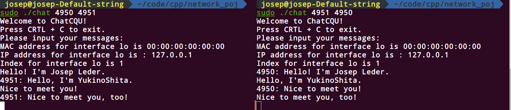

# CQU-Network-Project-2020

A simple chatting system based on C raw socket.

##  Environments

My environment:

1. gcc version 7.5.0 
2. Ubuntu 18.04

Just make sure you run the codes on a **Linux** system.

## Quick Start

First, compile the ChatCQU.c:

```shell
gcc ChatCQU.c -lpthread -o chat
```

And run 2 programs in different shells. You have to specify the port of this program and the port you want to send messages as follows

```shell
sudo ./chat 4950 4951
sudo ./chat 4951 4950
```

Then you can start chatting



## Features

1. Ethernet Frame
2. IPv4 packet
3. UDP pakect
4. Checksum
5. IP fragment
6. 1 to 1 chatting by ports

## Reference

Most of code refer to this website https://www.pdbuchan.com/rawsock/rawsock.html.
Also, thank my roommate cyy for offerring me a lot of guidance. Here is his implementaion https://github.com/cyyself/network-project.
